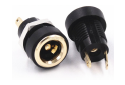

# TempHumidBox
<h1>อุปกรณ์ออกแบบกล่อง</h1>

Bread Board สำหรับใส่ NodeMCU v.2 (ESP8266)

ขนาด : 47mm. x 35mm.

  

ตัวตรวจวัดอุณหภูมิและความชื้น DHT22

ขนาด : 35mm. x 15mm.

    

ชุดเปิด/ปิดไฟ 1 ช่องทาง (1 Ch. Relay Module)

ขนาด : 50mm. x 25mm.

      

หลอดไฟแสดงผล (LED) ขนาด 5mm.

ขนาด : 5mm.

  

ปุ่มกด (Push Switch)

ขนาด : 21mm. x 15mm.

          

ขั้วต่อไปเลี้ยงแบบกลม

ขนาด : 3.7 mm.

  

น๊อต M2-M3

ขนาด : M2 1.5mm. และ M3 2.5mm.

